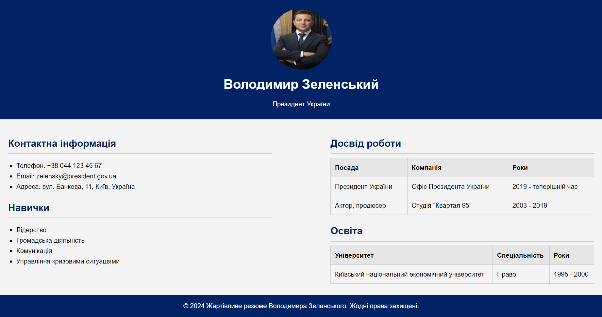
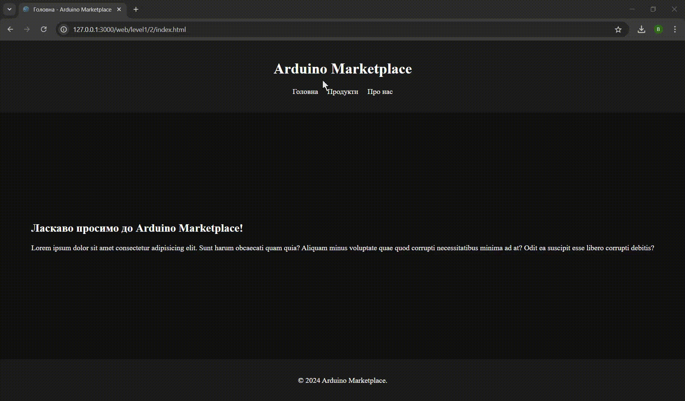
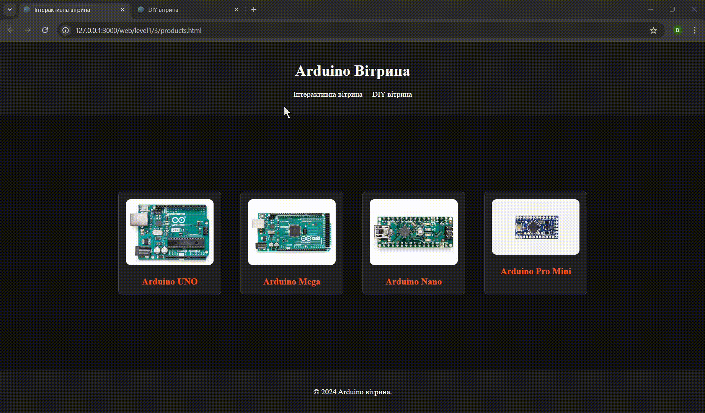
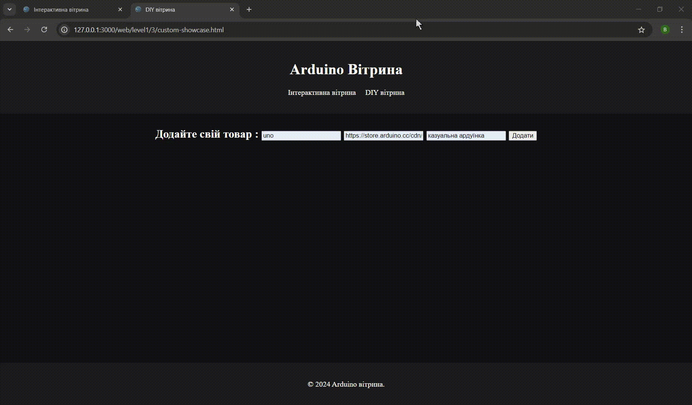

# [Джерельний код](https://github.com/BogdanBackend/RoboCamp2024/tree/main/web/level1)

# Level 1
## [1 резюме](https://bogdanbackend.github.io/RoboCamp2024/web/level1/1/index.html)
Задача 1
Створити односторінковий сайт у вигляді резюме використовуючи HTML та CSS.
При розробці сторінки мають бути використані:  
1. Списки
2. Таблиці
3. Будь-який спосіб позиціювання елементів
Можна використати будь-яку особу при створенні резюме.
Оформлення та стилізація сторінки може бути на власний розсуд.

## [2 маркетплейс](https://bogdanbackend.github.io/RoboCamp2024/web/level1/2/index.html)
Задача 2
Створити багатосторінковий сайт на тему “Маркетплейс” використовуючи HTML та CSS.
1. На сайті повинні бути три основні блоки: Header, Main та Footer
2. Елементи сторінки мають бути позиціоновані з використанням Flexbox та Grid
3. При розробці сайту обов’язково використати хоча б один псевдоклас
Тематика маркетплейсу може бути обрана на власний розсуд.

## [3 вітрина](https://bogdanbackend.github.io/RoboCamp2024/web/level1/3/custom-showcase.html)
Задача 3
Створити сайт на тему “Вітрина” використовуючи HTML, CSS та jQuery.
1. На сторінці мають бути створені три різних типи вітрин.
2. Об’єкти на одній з вітрин мають бути інтерактивні.
3. Додати можливість додавання власних об’єктів на одну з вітрин.
Вітрина може відображати об’єкти на довільну тему.

